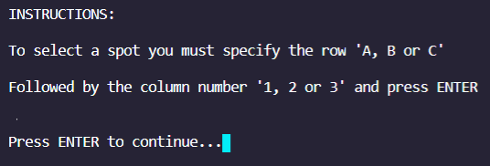
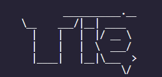

  
   
  <h3 align="center"><strong>Tic Tac Toe Interactive Game Built With RUBY OOP</strong></h3>
  

     
  
   
   
    <a href="https://github.com/leonmezu1/Tic-Tac-Toe"> Explore the repo</a> - <a href="https://github.com/leonmezu1/Tic-Tac-Toe/issues">Report Bug »</a>
  

<!-- TABLE OF CONTENTS -->

## Index

- [Index](#index)
- [About The Project](#about-the-project)
- [Prerequisites and Instructions](#prerequisites-and-instructions)
- [How to Play](#how-to-play)
- [Built With](#built-with)
- [Contact](#contact)
- [Acknowledgements](#acknowledgements)

<!-- ABOUT THE PROJECT -->

## About The Project

This Project consists in building the classic and famous Tic-Tac-Toe Game from the scratch using Ruby OOP.

As a prior requirement the game must be fully functional.

The project especifications are also described in: [theodinproject.com](https://www.theodinproject.com/courses/ruby-programming/lessons/oop)

## Prerequisites and Instructions

- To run this project Ruby lang, must be installed:

  - Ruby installation on windows

  `https://www.ruby-lang.org/es/documentation/installation/#rubyinstaller`

  - Ruby installation on Linux

  `sudo apt-get install ruby-full`

  - Clone the repo

  `https://github.com/leonmezu1/Tic-Tac-Toe.git`

- Game execution

  - To properly execute de game you can execute the main file via command:

  `bin/main.rb`

  - Or directly execute the main.rb file from the explorer.

## How to Play

Running the main.rb file you will be prompted as the following image:

  
 
  

You can select the option X to play the game or I to read the instructions, any other input is rejected.

The instructions and the game mechanic is also described in the following images:

   
 
  

   
 
  

If your option was 'X' now you will be in the game mode selection screen, you will be asked to provide your nickname(s) after choosing:

   
 
  

Now you are READY!, let's play. 😎

   
 
  

Once any player or the computer wins or if a tie is generated the game will be terminated just after showing the game results 😎

   
 
   
  
  

### Built With

This project has been developed with:

- [RUBY Lang](https://www.ruby-lang.org/es/)

Debugging operation is supported by:

- [RUBOCOP LINTERN](https://github.com/microverseinc/linters-config/tree/master/ruby)

<!-- CONTACT -->

## Contact

Project Link: [https://github.com/leonmezu1/Enumerables](https://github.com/leonmezu1/Enumerables)

Leonardo Mezu - [Leonardo Mezu L.](https://github.com/leonmezu1)

    <a target="_blank" href="https://mail.google.com/mail/?view=cm&fs=1&tf=1&to=leo7xs@gmail.com">
      leo7xs@gmail.com
    </a> &nbsp; |
    <a target="_blank" href="https://github.com/leonmezu1?tab=repositories">
      Portfolio
    </a> &nbsp; |
    <a target="_blank" href="https://www.linkedin.com/in/leonardomezlob/">
      LinkedIn
    </a> &nbsp; |
    <a target="_blank" href="https://twitter.com/https://twitter.com/leonmezu">
      Twitter
    </a>

<!-- ACKNOWLEDGEMENTS -->

## Acknowledgements

- [Microverse curriculum basic Ruby section](https://www.microverse.org/?grsf=6ns691)
- [The Odin project: PROJECT: OOP](https://www.theodinproject.com/courses/ruby-programming/lessons/oop)

Leonardo Mezu - Microverse OOP Project.
